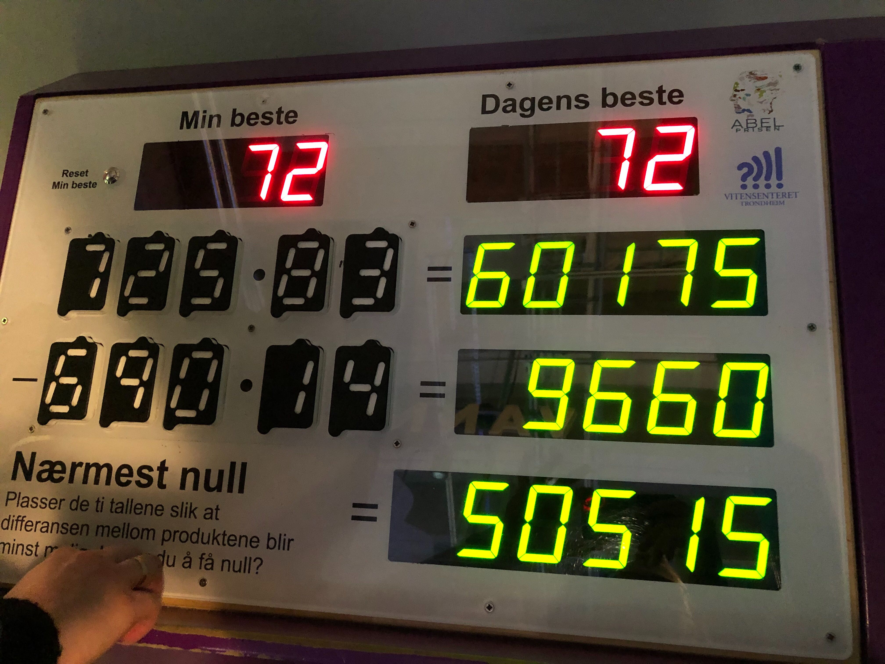

VilVite Puzzle
==============

Recently I was visiting [VilVite](https://www.vilvite.no/) (a fun science center for kids in Bergen, Norway)
and I've stumbled upon the following puzzle:

The rules are very simple:

1. There are exactly 10 RFID blocks with digits from 0 - 9 available
2. There is an equation `N1 * N2 - N3 * N4` where those 10 blocks fit
3. Find a combination of digits which provides a solution closest to 0.

At that time I couldn't figure it out and after a bunch of failed attempts I gave up.
But the problem was sitting in my head and I've finally decided to use the good 'ol brute-force to get it solved.

Now that I know all 198 solutions, I can crush other kids' bests on every single visit ;)